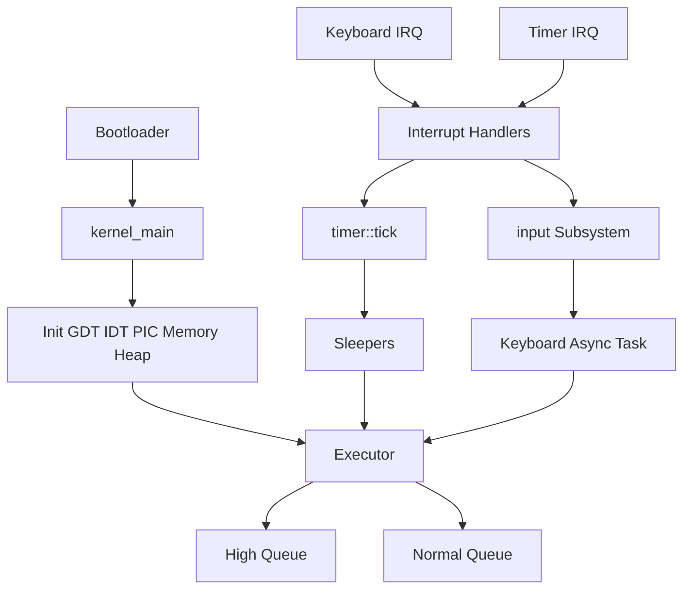
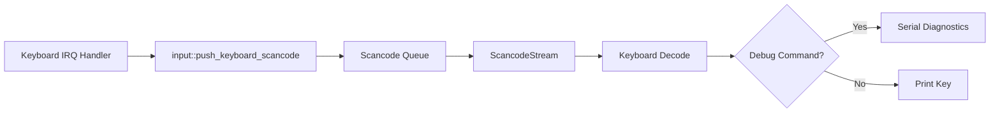
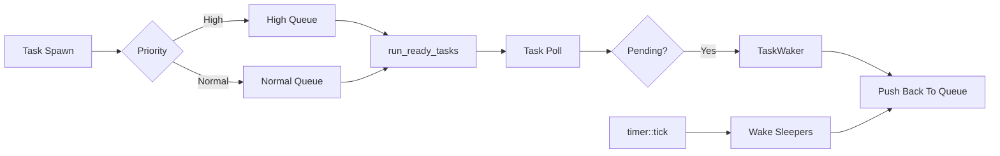

# OS by Rust (Async Kernel Demo)

一个基于 Rust 的教学型 `no_std` 操作系统内核项目，核心目标是展示：

- x86_64 下的基础内核启动与中断处理
- 内存管理与堆分配
- 基于 `Future` 的协作式异步任务系统
- 输入中断与异步任务解耦
- 可观测、可测试、可演进的内核代码结构

---

## 1. 项目特性

- 内存管理：页表初始化 + 物理帧分配 + 多策略堆分配器
- 中断子系统：IDT、PIC、页错误、键盘/定时器中断
- 异步任务系统：`Task` + `Executor` + `Waker`
- 调度增强：
  - 任务优先级（`High` / `Normal`）
  - tick 驱动的 `sleep_ticks` 延迟唤醒
- 输入子系统：
  - 键盘扫描码队列与唤醒器集中在 `input` 模块
  - 缓冲策略可切换（drop-new / drop-old）
- 可观测性：
  - 执行器统计快照
  - 输入丢包/未初始化计数
  - 键盘命令行诊断（`s` / `r` / `h`）

---

## 2. 架构总览

### 2.1 内核运行链路



### 2.2 输入与异步任务解耦



### 2.3 调度与休眠唤醒



---

## 3. 项目文件树

```text
os_by_rust_after_async_await/
├── .cargo/
│   └── config.toml
├── async_test/
│   ├── Cargo.toml
│   ├── README.md
│   └── src/main.rs
├── src/
│   ├── allocator.rs
│   ├── allocator/
│   │   ├── bump.rs
│   │   ├── fixed_size_block.rs
│   │   └── linked_list.rs
│   ├── gdt.rs
│   ├── input.rs
│   ├── interrupts.rs
│   ├── lib.rs
│   ├── main.rs
│   ├── memory.rs
│   ├── serial.rs
│   ├── task/
│   │   ├── executor.rs
│   │   ├── keyboard.rs
│   │   ├── mod.rs
│   │   ├── simple_executor.rs
│   │   └── timer.rs
│   ├── testing.rs
│   └── vga_buffer.rs
├── tests/
│   ├── basic_boot.rs
│   ├── executor_smoke.rs
│   ├── heap_allocation.rs
│   ├── input_policy_smoke.rs
│   ├── input_smoke.rs
│   ├── priority_smoke.rs
│   ├── should_panic.rs
│   ├── stack_overflow.rs
│   └── timer_sleep_smoke.rs
├── Cargo.toml
├── Cargo.lock
├── rust-toolchain.toml
├── TESTING_GUIDE.md
└── x86_64-os_by_rust.json
```

---

## 4. 关键设计思路

### 4.1 内存管理与堆分配

- 通过 `memory` 模块完成页表与物理帧初始化
- 堆初始化后支持 `Box` / `Vec` 等动态分配
- 分配器组合：
  - `FixedSizeBlockAllocator`：小对象高频分配
  - `LinkedListAllocator`：回退处理大块分配
  - `BumpAllocator`：教学/测试用途

### 4.2 中断处理

- 初始化 IDT 并注册异常与外部中断处理器
- 键盘中断只做最小工作：读取扫描码 -> 推送到 `input`
- 定时器中断推进全局 tick：`task::timer::tick()`
- 避免把复杂逻辑放在中断上下文，降低延迟风险

### 4.3 异步任务调度

- `Task` 是 `Future<Output = ()>` 的封装，带唯一 `TaskId`
- `Executor` 使用双队列实现优先级调度：
  - `High` 优先消费
  - `Normal` 次级消费
- `TaskWaker` 负责把任务重新入队
- 队列满时采用降级计数，不直接 `panic`

### 4.4 tick 驱动休眠 (`sleep_ticks`)

- `timer::sleep_ticks(n)` 返回 `Future`
- 任务 `poll` 时把自身 waker 注册到睡眠表
- 定时器 tick 到达后统一唤醒到期任务
- 适合作为后续定时任务/超时机制基础

### 4.5 输入子系统与缓冲策略

- `input` 模块统一管理：
  - 扫描码队列
  - 输入 waker
  - 丢弃计数/未初始化计数
- 支持策略切换（feature）：
  - `input-drop-new`：队列满时丢弃新输入（默认）
  - `input-drop-old`：队列满时淘汰旧输入，保留新输入
- 互斥保护：两个策略不能同时启用

### 4.6 诊断与调试

- 键盘命令：
  - `s`：打印统计（调度 + 输入）
  - `r`：重置输入计数
  - `h`：打印帮助
- `diagnostic-panel` feature 开启后，后台定时输出统计面板

---

## 5. 构建与运行

### 5.1 环境要求

- Rust nightly（`rust-toolchain.toml` 已固定）
- 组件：`rust-src`、`llvm-tools-preview`
- 工具：`bootimage`
- 运行器：`qemu-system-x86_64`

### 5.2 初始化环境

```bash
rustup toolchain install nightly
rustup default nightly
rustup component add rust-src llvm-tools-preview
cargo install bootimage
```

### 5.3 编译/运行

```bash
# 构建内核镜像
cargo bootimage

# 启动内核（通过 .cargo/config.toml 中 runner）
cargo run
```

### 5.4 常用 feature 组合

```bash
# 开启周期性诊断面板
cargo run --features diagnostic-panel

# 开启定时器tick打印（调试中断节奏）
cargo run --features debug-timer-ticks

# 使用 drop-old 输入缓冲策略
cargo run --no-default-features --features input-drop-old
```

---

## 6. 测试说明

### 6.1 测试入口

```bash
# 全部测试
cargo test

# 库内测试
cargo test --lib

# 指定测试
cargo test --test basic_boot
cargo test --test heap_allocation
cargo test --test should_panic
cargo test --test stack_overflow
cargo test --test executor_smoke
cargo test --test input_smoke
cargo test --test input_policy_smoke
cargo test --test priority_smoke
cargo test --test timer_sleep_smoke
```

### 6.2 测试覆盖点

- `basic_boot`：基础启动路径
- `heap_allocation`：堆分配/回收行为
- `should_panic`：panic 语义校验
- `stack_overflow`：double fault 路径
- `executor_smoke`：执行器基本唤醒链路
- `input_smoke`：输入初始化与计数行为
- `input_policy_smoke`：输入缓冲策略行为
- `priority_smoke`：高优先级任务先执行
- `timer_sleep_smoke`：`sleep_ticks` 唤醒语义

---

## 7. 开发建议

- 优先用 `try_spawn`，避免调度压力下因 `spawn` 失败直接 panic
- 中断处理保持最小化，复杂逻辑尽量放入任务上下文
- 新增 feature 时优先考虑互斥/默认行为，避免组合歧义
- 新能力落地时同步增加 smoke 测试，保持演进可回归

---

## 8. 参考命令速查

```bash
# 只检查编译（不跑QEMU）
cargo check --tests

# 编译并运行 async_test（宿主机演示）
cd async_test && cargo run

# 查看当前feature组合是否生效（通过日志观察）
cargo run --features "diagnostic-panel,debug-timer-ticks"
```
